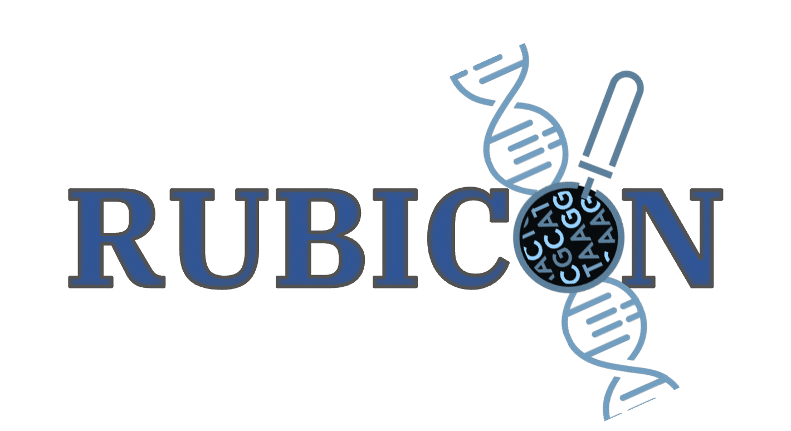

<p align="center">
  <picture>
    <source media="(prefers-color-scheme: light)" srcset="logo/rub2.png">
  
</picture>
  <h3 align="center">A Framework for Designing Efficient Deep Learning-Based Genomic Basecallers
  </h3>
</p>


# What is RUBICON?
 RUBICON is a framework for developing hardware-optimized basecallers. It consists of four modules: QABAS, SkipClip, Pruning with Knowledge Distillation, and Training with Knowledge Distillation. 

QABAS and SkipClip are two novel machine learning-based techniques specifically designed for basecalling. QABAS  is the first quantization-aware basecalling neural architecture search framework to specialize the basecalling neural network architecture for a given hardware acceleration platform while jointly exploring and finding the best bit-width precision for each neural network layer. SkipClip is the first technique to remove the skip connections present in modern basecallers to greatly reduce resource and storage requirements without any loss in basecalling accuracy.  

In addition, RUBICON provides support for Pruning, which is a popular model compression technique where we discard network connections that are unimportant to neural network performance. We integrated the training module from the official ONT research project. For both the Pruning and Training modules, we provide the capability to use knowledge distillation (KD) for faster convergence and to increase the accuracy of the target neural network.

## Installation procedure
```bash
$ git clone --recurse-submodules  https://github.com/Xilinx/neuralArchitectureReshaping # 
$ cd neuralArchitectureReshaping
$ python3.8 -m venv venv3 # or conda create --name rubicon python=3.8
$ source venv3/bin/activate
$ python3.8 -m pip install pip==23.2.1
$ pip install -r requirements_rocm.txt or pip install -r requirements_cuda.txt # depending upon AMD or NVIDIA GPU. 
# AMD modules are tested using ROCM 5.1.1 and NVIDIA modules with CUDA 11.4
$ cd rubicon/tools/nni
$ python setup.py develop 
$ cd ../nn_Meter
$ python setup.py develop 
$ cd ~/neuralArchitectureReshaping
$ python setup.py develop 
$ cd rubicon
```
## Additional dependencies
- torch==2.0.0+cu118
- bonito==0.6.2

Download the official ONT dataset (12.2 GiB)
``` bash
$  bonito download --training #will download ONT dataset 
```

## Interface
 - `rubicon qabas` - quantization-aware basecalling neural architecture search.
 - `rubicon prune` - prune a model.
 - `rubicon skiptrim` - remove skip connection using knowledge distillation.
 - `rubicon train` - train a model.


## Quantization-Aware Basecalling Neural Architecture Search (QABAS)
We use neural architecture search (NAS) to explore different design options for a basecaller.
We use a differentiable NAS (DNAS) approach, which is a weight-sharing approach where we train only one supernetwork and distill a sub-network out of it. We define a search space that consists of all the options for a model. The search space for Rubicon is defined in `arch/basemodelquant.py`.

QABAS base code is from the open-source [NNI](https://github.com/microsoft/nni) project. Please refer to NNI [Documention](https://nni.readthedocs.io/en/stable/nas/overview.html) for more information. 

```bash
cd ..
# make sure to have the necessary dataset bonito download -training
rubicon qabas path_to_store_search_data -f --batch 64 --no-amp --epoch 100 --reference_latency 7500 --nas proxy --rub_ctrl_opt --rub_arch_opt --rub_sched --full --default --directory <Path to bonito training data>
```

`--nas` has two options  `{darts, proxy}`. 

&nbsp;&nbsp;&nbsp;&nbsp;Use `proxy` use ProxylessNAS to perform NAS. ProxylessNAS binarizes the edges of the supernetwork while training, which makes it faster and more memory efficient than DARTS but requires hyper-parameter tuning to converge to an optimal solution.

&nbsp;&nbsp;&nbsp;&nbsp;Use `darts` use DARTS to perform NAS. 

`--chunks` to limit the number of samples.

`--batch` set the batchsize.

`--applied_hardware` is used to choose platform  `{aie_lut, cpu, gpu}`. We use [nn-meter](https://github.com/microsoft/nn-Meter) to generate a latency estimator.

`--reference_latency` to guide the search.

`--grad_reg_loss_lambda` to update lambda value.


## Skip Removal with Knowledge Distillation
SkipClip performs a gradual skip removal process with knowledge distillation (KD). KD is a model compression technique where a shallower model (student) learns to mimic a pre-trained bigger model (teacher) by transferring learned knowledge and label representation from the teacher to the student. SkipClip starts with a pre-trained over-parameterized model as the teacher, which needs to be updated during the training of the student network.  We remove skip connections by letting the teacher teach the student to perform well on basecalling. At the start of every training epoch, SkipClip removes a skip connection from a block, starting from the input side, while performing KD. This is done until all skip connections are removed from the student network. SkipClip gets the best of both worlds: a highly accurate and topologically regular neural network without skip connections.

Download a model to use as the teacher:
``` bash
$ cd models
$ bash download_teacher.sh
```

```bash
cd rubicon
# make sure to have the necessary dataset Rubicon download -training 
rubicon skipclip path_to_store_student_model -f --full --batch 64 --no-amp --epoch 100  --temp 2 --alpha 0.9 --type rubiconqabas-mp
```

`--teacher_directory` add teacher path (`default=models/bonito`).

`--full` is the complete dataset.

`--temp` temperature for KD (default=2).

`--alpha` alpha for KD (default=0.9).

`--type` performs SkipClip on QABAS generated model.

`--skip_stride` changes the stride at which the skip connection should be removed.

## Pruning your model
Pruning is a model compression technique where we discard network connections unimportant to network performance without affecting the inference accuracy. In a neural network, weights close to zero contribute little to the model’s inference. Performing convolution on such weights is equivalent to performing multiplication with zero. Therefore, removing such weights could lead to a reduction in redundant operations, in turn providing higher throughput and lower memory footprint both during the training and the inference phase of a neural network.

We support two different pruning techniques: (a) unstructured pruning and (b) structured pruning. Unstructured or element pruning is a fine-grained way of pruning individual weights in a neural network without applying structural constraints.  In structured pruning, we remove a larger set of weights while maintaining a dense model structure. 

Download a model to use as the teacher:
``` bash
$ cd rubicon/models
$ bash download_teacher.sh # we use Bonito_CTC from ONT as the teacher
```

```bash
cd rubicon
# make sure to have the necessary dataset Rubicon download -training 
rubicon prune path_to_store_pruned_model --full --batch 64 --no-amp --epoch 100  --temp 2 --alpha 0.9 --type rubiconqabas --prune 0.5 -f  -struct  -l1 --teacher
```

`--type` type of model to use `{rubiconqabas,bonito, staticquant}`. 

&nbsp;&nbsp;&nbsp;&nbsp;Use `rubiconqabas` to prune QABAS model.

&nbsp;&nbsp;&nbsp;&nbsp;Use `bonito` to prune Bonito model.

&nbsp;&nbsp;&nbsp;&nbsp;Use `staticquant` to prune models that are statically quantized.

`--teacher` flag will perform training using knowledge distillation (KD). 

`--prune` fraction of the model to prune.

`--temp` temperature for KD (default=2).

`--alpha` alpha for KD (default=0.9).

`-struct` passing enables structured channel pruning, else unstructed element pruning.

`-l1` choose pruning weights using L1-norm, else weights are randomly selected.

## Training your model
Train your model with knowledge distillation.

Download a model to use as the teacher:
``` bash
$ cd models
$ bash download_teacher.sh
```

```bash
cd rubicon
# make sure to have the necessary dataset Rubicon download -training 
rubicon train path_to_store_trained_model -f --full --batch 64 --no-amp --epoch 100  --temp 2 --alpha 0.9 --type rubiconqabas-mp --teacher
```

`--type` type of model to use `{rubiconqabas-mp,bonito, staticquant}`. 

&nbsp;&nbsp;&nbsp;&nbsp;Use `rubiconqabas-mp` to train QABAS model.

&nbsp;&nbsp;&nbsp;&nbsp;Use `bonito` to train our Bonito_CTC model.

&nbsp;&nbsp;&nbsp;&nbsp;Use `bonitostaticquant` to train models that are statically quantized.

&nbsp;&nbsp;&nbsp;&nbsp;&nbsp;To change weights and activation precision: Update `layer_weight_bits` and `act_bits` variables in `rubicon/arch/bonitostaticquant.py`

`--teacher` flag will perform training using knowledge distillation (KD). 

`--temp` temperature for KD (default=2).

`--alpha` alpha for KD (default=0.9).

## Basecalling 
Perform basecalling using a basecaller.

```bash
cd rubicon
# make sure to have the necessary reads
rubicon basecalling path_to_model path_to_reads --type rubiconqabas > path_to_basecalled_reads/file.fasta
```

`--type` is the type of model to use. 


&nbsp;&nbsp;&nbsp;&nbsp;Use `bonito` to use Bonito_CTC model.

&nbsp;&nbsp;&nbsp;&nbsp;Use `crf-fast` to use Bonito_CRF-fast model.

&nbsp;&nbsp;&nbsp;&nbsp;Use `crf-sup` to use Bonito_CRF-sup model.

&nbsp;&nbsp;&nbsp;&nbsp;Use `rubiconqabas` to use QABAS model.

&nbsp;&nbsp;&nbsp;&nbsp;Use `rubiconnoskipfp` to RUBICALL-FP model.

&nbsp;&nbsp;&nbsp;&nbsp;Use `rubicallmp` to use RUBICALL-MP model.

&nbsp;&nbsp;&nbsp;&nbsp;Use `staticquant` to use models that are statically quantized.

Note: Quantized models use the Brevitas library to perform quantization, which leads to additional runtime overhead.

# Directory Structure
```
rubicon
├───rubicon
├───├───1. arch
├───└───2. basemodule
├───├───3. data
├───├───4. models
├───├───5. nas
├───6. rubicall 
├───logo

```            
1. In the "arch" directory, we have all the different models 
2. In the "basemodule" directory, we have different RUBICON modules
3. All training data and data related to species are downloaded in the "data" directory
4. We store pre-trained models under "models" directory
5. In the "nas" directory, we have modules from [NNI](https://github.com/microsoft/nni) to support QABAS
6. In "rubicall" we provide all the necessary tools, scripts, datasets, and commands to reproduce the results in our paper

# Citation
```bibtex
@article{singh2024rubicon,
  title={RUBICON: a framework for designing efficient deep learning-based genomic basecallers},
  author={Singh, Gagandeep and Alser, Mohammed and Denolf, Kristof and Firtina, Can and Khodamoradi, Alireza and Cavlak, Meryem Banu and Corporaal, Henk and Mutlu, Onur},
  journal={Genome biology},
  year={2024}
}
```

RUBICON is designed using the official ONT [Bonito](https://github.com/nanoporetech/bonito) project. 

Please also consider citing:
- Refer [Bonito](https://github.com/nanoporetech/bonito) for basecalling.
- Refer [Brevitas](https://github.com/Xilinx/brevitas) for quantization.
- Refer [NNI](https://github.com/microsoft/nni) for NAS.
- Refer [nn-meter](https://github.com/microsoft/nn-Meter) to generate latency predictor for NAS. 

# Getting Help
If you have suggestions for improvement, new applications, or collaboration, please contact Gagandeep Singh (gagandeep dot singh at amd dot com).
